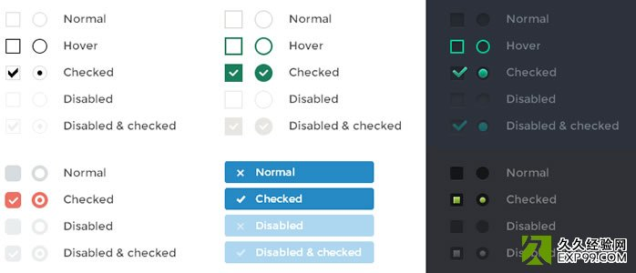

## iCheck表单美化插件使用方法详解（含参数、事件等）

> 方便实用, 值得收藏.

### 特色

1、在不同浏览器(包括ie6+)和设备上都有相同的表现 — 包括 桌面和移动设备

2、支持触摸设备 — iOS、Android、BlackBerry、Windows Phone等系统

4、方便定制 — 用HTML 和 CSS 即可为其设置样式 (多套皮肤)

5、体积小巧 — gzip压缩后只有1 kb

6、25 种参数 用来定制复选框（checkbox）和单选按钮（radio button）

7、8 个回调事件 用来监听输入框的状态

8、7个方法 用来通过编程方式控制输入框的状态

9、能够将输入框的状态变化同步回原始输入框中， 支持所有选择器



### iCheck使用方法

``` javascript
    $('input').iCheck('check');   //将输入框的状态设置为checked 
    $('input').iCheck('uncheck'); //移除 checked 状态 
    $('input').iCheck('toggle');  //toggle checked state 
    $('input').iCheck('disable'); //将输入框的状态设置为 disabled 
    $('input').iCheck('enable');  //移除 disabled 状态 
    $('input').iCheck('update');  //apply input changes, which were done outside the plugin 
    $('input').iCheck('destroy'); //移除iCheck样式 
```

调用iCheck时，只需要将修改了默认值的参数列出来即可：

```javascript
    //基础使用方法 
    $('input').iCheck({ 
      labelHover : false, 
      cursor : true, 
      checkboxClass : 'icheckbox_square-blue', 
      radioClass : 'iradio_square-blue', 
      increaseArea : '20%' 
    }); 
```

下面是参数列表及其默认值：

    { 
     handle: '', 
     checkboxClass: 'icheckbox', 
     radioClass: 'iradio', 
     checkedClass: 'checked', 
     checkedCheckboxClass: '', 
     checkedRadioClass: '', 
     uncheckedClass: '', 
     uncheckedCheckboxClass: '', 
     uncheckedRadioClass: '', 
     disabledClass: 'disabled', 
     disabledCheckboxClass: '', 
     disabledRadioClass: '', 
     enabledClass: '', 
     enabledCheckboxClass: '', 
     enabledRadioClass: '', 
     hoverClass: 'hover', 
     focusClass: 'focus', 
     activeClass: 'active', 
     labelHover: true, 
     labelHoverClass: 'hover', 
     increaseArea: '', 
     cursor: false, 
     inheritClass: false, 
     inheritID: false, 
     insert: '' 
    } 

### iCheck皮肤

    Black — minimal.css  //黑色
    Red — red.css  //红色
    Green — green.css  //绿色
    Blue — blue.css  //蓝色
    Aero — aero.css //win7中的那种玻璃效果
    Grey — grey.css  //银灰色
    Orange — orange.css  //橙色
    Yellow — yellow.css  //黄色
    Pink — pink.css  //粉红色
    Purple — purple.css  //紫色

> （请自行下载这些皮肤包）

### iCheck初始化

首先，引入jQuery库文件

其次，引入jquery.icheck.js插件文件

（如果要引入相关皮肤，则需引入：相关主题颜色.css文件）

### iCheck回调事件

iCheck支持所有选择器（selectors），并且只针对复选框checkbox和单选radio按钮起作用
iCheck提供了大量回调事件，都可以用来监听change事件

- ifClicked   // 用户点击了自定义的输入框或与其相关联的label
- ifChanged   // 输入框的 checked 或 disabled 状态改变了
- ifChecked   // 输入框的状态变为 checked
- ifUnchecked   // checked 状态被移除
- ifDisabled  // 输入框状态变为 disabled
- ifEnabled   // disabled 状态被移除
- ifCreated   // 输入框被应用了iCheck样式
- ifDestroyed    //  iCheck样式被移除

 使用on()方法绑定事件：

```javascript
     $('input').on('ifChecked', function(event){ //ifCreated 事件应该在插件初始化之前绑定 
      alert(event.type + ' callback'); 
    });   
```

bootstrap iCheck中的radio和checkbox的大小可以调整吗？

    .icheckbox_square-blue, .iradio_square-blue { 
      display: block; 
      margin: 0; 
      padding: 0; 
      width: 22px; 
      height: 22px; 
      background: url(blue.png) no-repeat; 
      border: none; 
      cursor: pointer; 
    }   

如果要调整icheck的radio或checkbox样式，通过上面的css修改width和height，同时修改blue.png图片对应的尺寸。

[iCheck github地址](https://github.com/fronteed/iCheck)

> 文章来源：http://www.exp99.com/f2e/iCheck.html